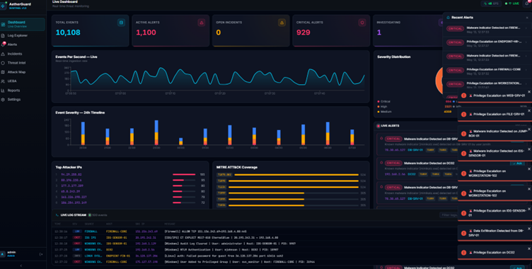
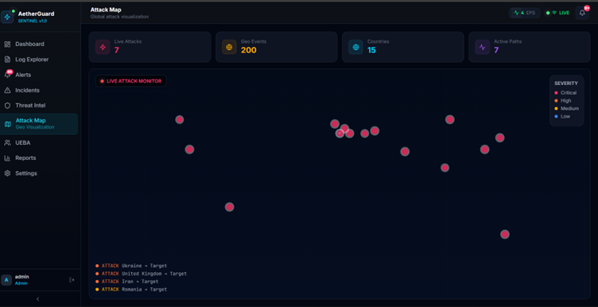
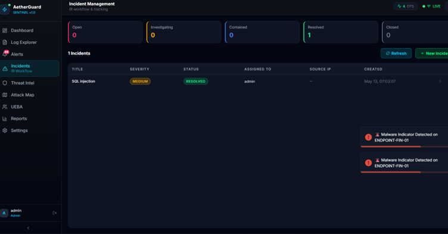
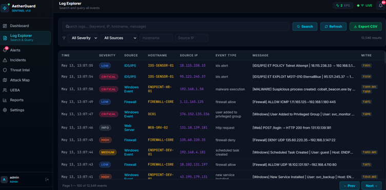
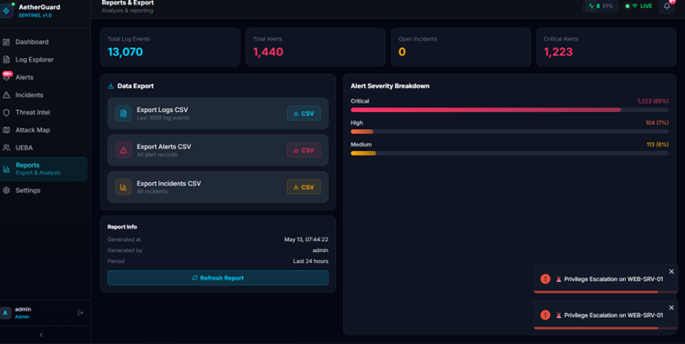
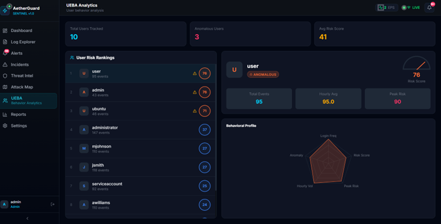

# AetherGuard Sentinel

## Real-Time Threat Detection & SOC Intelligence Platform

### Features
- Real-time log streaming
- SIEM dashboard
- UEBA anomaly detection
- Incident management
- Threat intelligence
- Attack simulation
- Live attack map

### Tech Stack
- React.js
- FastAPI
- MongoDB
- WebSockets
- Scikit-learn

### Screenshots
(Add images here)

### Installation
```bash
npm install
pip install -r requirements.txt

# Dashboard Preview

## Dashboard


## Attack Map


## Incident Management


## Log Explorer


## Report


## UEBA Analytics


